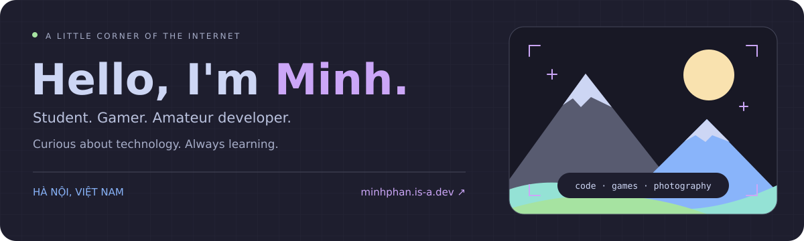

  <a href="https://minhphan.is-a.dev/">Website</a> ·
  <a href="https://minhphan.is-a.dev/blog/">Blog</a> ·
  <a href="#things-im-exploring">Exploring</a> ·
  <a href="#lets-connect">Connect</a>

## The person behind the screen

I'm **Phan Sơn Bảo Minh**, a student, gamer, and amateur developer from **Hà Nội, Việt Nam**. I started coding because I wanted to make things that other people could use. These days, that curiosity takes me from small web projects to Linux, smart homes, and photography.

I'm studying at **[Hanoi University of Mining and Geology (HUMG)](https://humg.edu.vn/Pages/home.aspx)**, where I began in **2026**. Before that, I attended **[Bac Thang Long High School](http://thptbacthanglong.edu.vn/)** from **2023 to 2026**.

## Things I'm exploring

| Area | What keeps me curious |
| :--- | :--- |
| **Linux** | Exploring **Arch Linux** and **CachyOS**, and getting comfortable with the command line. |
| **Smart homes** | Learning about **Home Assistant** and home automation. |
| **Photography** | Learning about cameras and photography, especially **Canon** and **Fujifilm**. |

  
  
  

## My little corner of the web

### [Personal website & blog](https://minhphan.is-a.dev/)

A place for my interests, my learning journey, and a little Catppuccin. It brings together the person behind the code: what I'm studying, what I'm playing, and what I'm curious about next.

[Visit the website](https://minhphan.is-a.dev/) · [Read the blog](https://minhphan.is-a.dev/blog/)

### [Profile Card · v2](https://github.com/MinhPhan1203/ProfileCard-ver2)

A small HTML and CSS profile card from my web development journey. Simple projects are part of how I learn, and this is one of mine.

[View source](https://github.com/MinhPhan1203/ProfileCard-ver2) · [Earlier version](https://github.com/MinhPhan1203/Profile-Card-ver-1)

### From the blog: [How I learned to code](https://minhphan.is-a.dev/blog/blog1/)

How I got started, the resources I found along the way, and why I believe in starting small and learning through practice.

## Beyond the keyboard

- **Playing** — Teamfight Tactics and Arena of Valor.
- **Listening** — Lil Liem and Ngọt.
- **Away from the screen** — badminton and learning photography.
- **Camera curiosity** — Canon and Fujifilm; getting to know DSLRs such as the EOS 5D Mark IV, 600D, and 6D Mark II.

## Let's connect

[Website](https://minhphan.is-a.dev/) · [Facebook](https://www.facebook.com/psbminhh/) · [Instagram](https://www.instagram.com/psbminhhh/) · [Discord](https://discord.com/users/926098921338593320)

Feel free to say hello — especially if you're into Linux, smart homes, games, or photography.

Discord presence & GitHub activity

 

---

Somewhere between code and curiosity. Always a work in progress.

